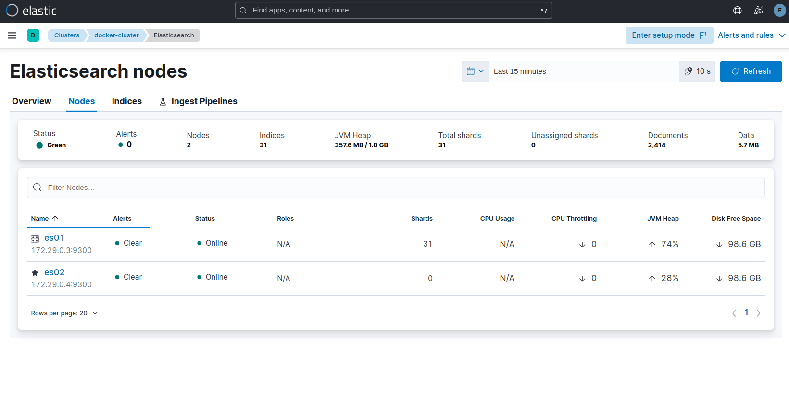

# to use curl command 
take ceart by
```bash
docker exec -it emmdi-es01-1 /bin/bash
cat config/certs/ca/ca.crt
```
copy the certs
```bash

curl -X GET "https://localhost:9200/_cat/nodes?v&pretty" --cacert ca.crt -u elastic:123456
```
 reference 
 https://www.elastic.co/guide/en/elasticsearch/reference/current/docker.html#docker-compose-file
# COMMON BUG 
```bash
sudo sysctl -w vm.max_map_count=262144 # fix bug exit code 78
```

Node is started with node.data=false, but has shard data when use node.roles=master
delete volume assosicate with that node

# some notes 

cluster.initial_master_nodes for set the node can be a master node maybe more than one


discovery.seed_hosts for discovery the remain node in the cluster

# kibana

login to kibana in localhost:5601 with user name elastic mk: 123456
