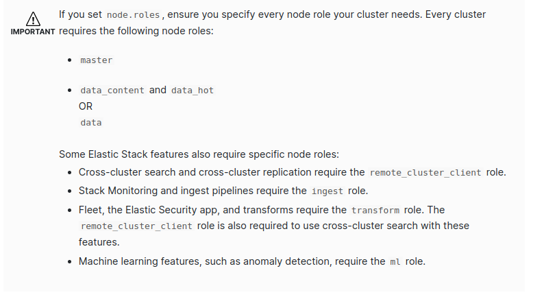

# change config in .env file
# to use curl command 
take ceart by
```bash
docker exec -it emmdi-es01-1 /bin/bash
cat config/certs/ca/ca.crt
```
copy the certs
```bash

curl -X GET "https://localhost:9200/_cat/nodes?v&pretty" --cacert ca.crt -u elastic:123456
```
 reference 
 https://www.elastic.co/guide/en/elasticsearch/reference/current/docker.html#docker-compose-file
# COMMON BUG 
```bash
sudo sysctl -w vm.max_map_count=262144 # fix bug exit code 78
```

Node is started with node.data=false, but has shard data when use node.roles=master
delete volume assosicate with that node

# some notes 

- cluster.initial_master_nodes for set the node can be a master node maybe more than one
- at least 2 node can be a master node when set node.roles.
- bug
-  `{"@timestamp":"2024-01-25T05:03:39.555Z", "log.level": "WARN", "message":"master not discovered yet, this node has not previously joined a bootstrapped cluster, and this node must discover master-eligible nodes [es01, es02] to bootstrap a cluster: have discovered [{es01}{XfPQ4-BjR7uwV14YEvVqXw}{iSbGN-elSduX5utyjLajUg}{es01}{192.168.176.2}{192.168.176.2:9300}{m}{8.12.0}{7000099-8500008}]; discovery will continue using [192.168.176.3:9300] from hosts providers and [{es01}{XfPQ4-BjR7uwV14YEvVqXw}{iSbGN-elSduX5utyjLajUg}{es01}{192.168.176.2}{192.168.176.2:9300}{m}{8.12.0}{7000099-8500008}] from last-known cluster state; node term 0, last-accepted version 0 in term 0; for troubleshooting guidance, see https://www.elastic.co/guide/en/elasticsearch/reference/8.12/discovery-troubleshooting.html", "ecs.version": "1.2.0","service.name":"ES_ECS","event.dataset":"elasticsearch.server","process.thread.name":"elasticsearch[es01][cluster_coordination][T#1]","log.logger":"org.elasticsearch.cluster.coordination.ClusterFormationFailureHelper","elasticsearch.node.name":"es01","elasticsearch.cluster.name":"docker-cluster"}` 
- => cause by only one node can be a master node => cluster can not be formed fix by set at least 2 node can be a master node by set node.roles=somerole, master

- bug can't monitor by kiabana => add roles remote_cluster_client in master node
## reference 
https://www.elastic.co/guide/en/elasticsearch/reference/current/modules-node.html

# kibana

login to kibana in localhost:5601 with user name elastic mk: 123456


{"@timestamp":"2024-01-25T05:03:39.555Z", "log.level": "WARN", "message":"master not discovered yet, this node has not previously joined a bootstrapped cluster, and this node must discover master-eligible nodes [es01, es02] to bootstrap a cluster: have discovered [{es01}{XfPQ4-BjR7uwV14YEvVqXw}{iSbGN-elSduX5utyjLajUg}{es01}{192.168.176.2}{192.168.176.2:9300}{m}{8.12.0}{7000099-8500008}]; discovery will continue using [192.168.176.3:9300] from hosts providers and [{es01}{XfPQ4-BjR7uwV14YEvVqXw}{iSbGN-elSduX5utyjLajUg}{es01}{192.168.176.2}{192.168.176.2:9300}{m}{8.12.0}{7000099-8500008}] from last-known cluster state; node term 0, last-accepted version 0 in term 0; for troubleshooting guidance, see https://www.elastic.co/guide/en/elasticsearch/reference/8.12/discovery-troubleshooting.html", "ecs.version": "1.2.0","service.name":"ES_ECS","event.dataset":"elasticsearch.server","process.thread.name":"elasticsearch[es01][cluster_coordination][T#1]","log.logger":"org.elasticsearch.cluster.coordination.ClusterFormationFailureHelper","elasticsearch.node.name":"es01","elasticsearch.cluster.name":"docker-cluster"}